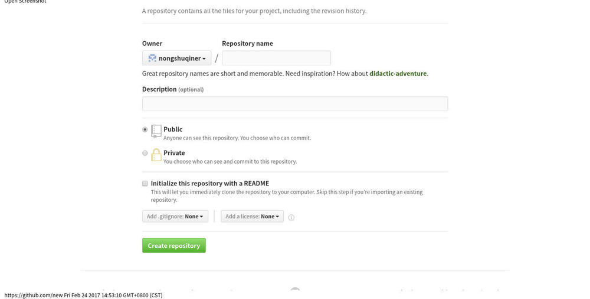
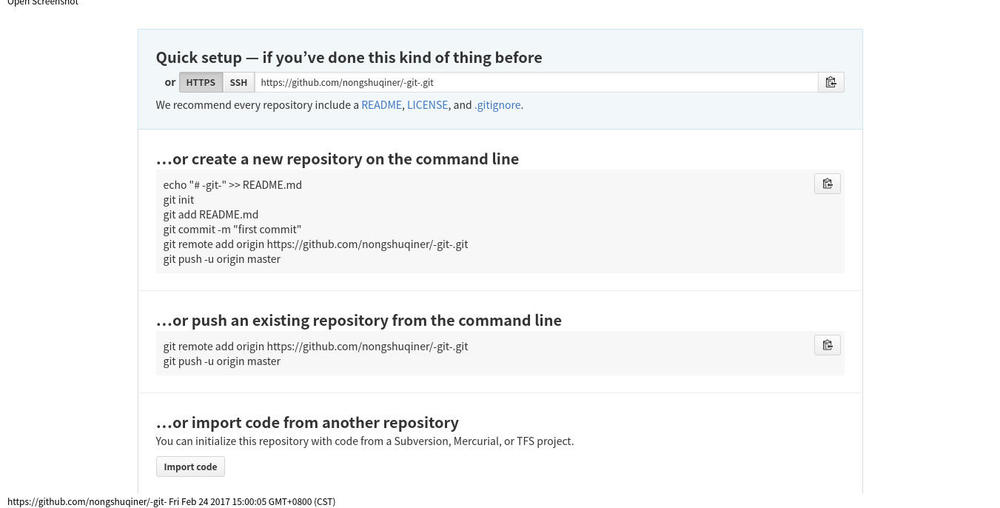
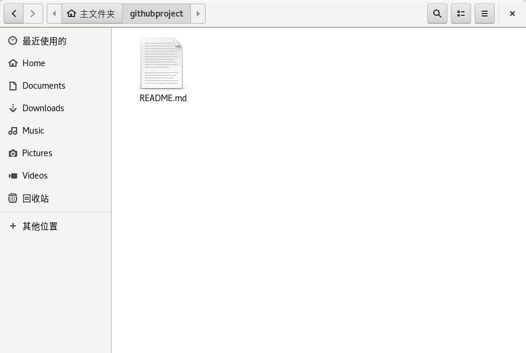
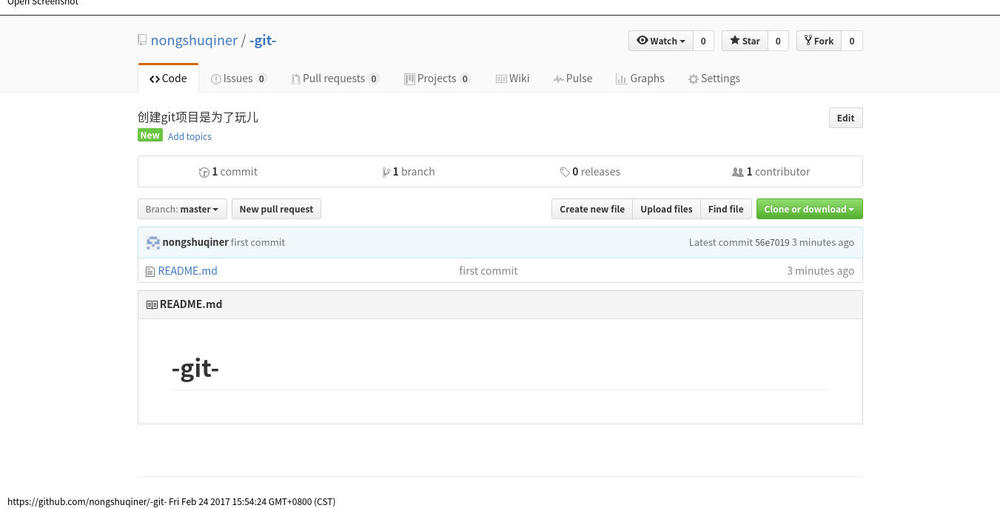
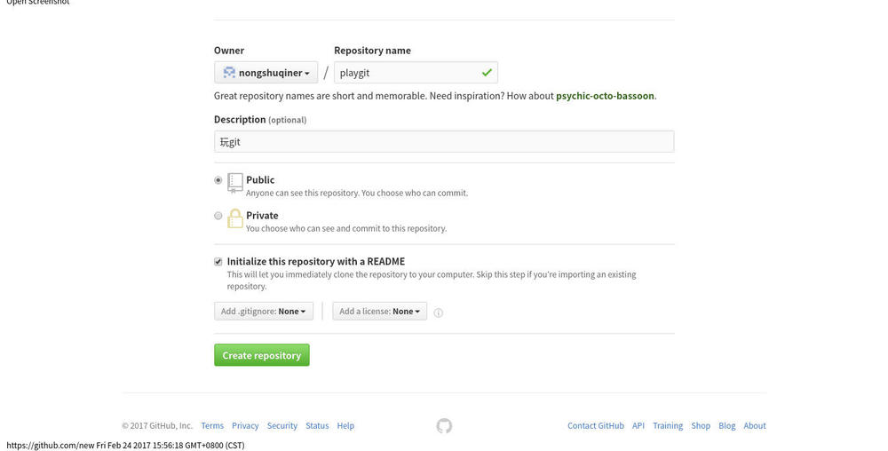
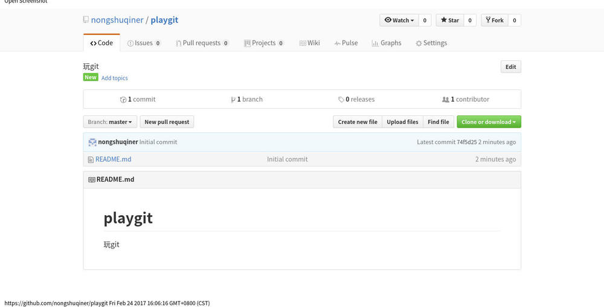
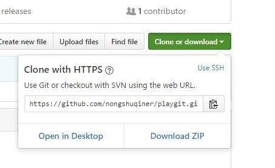
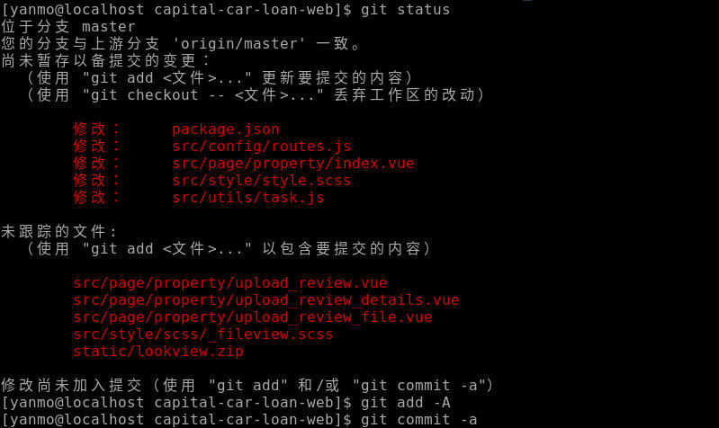

# git+github的使用-最简单的入门教程

​              

​             [言墨儿](https://www.jianshu.com/u/319464da1cc1)                          

​                                                    0.3                                                 2017.02.24 23:32*               字数 2015             阅读 18165评论 4喜欢 18

> 团队开发离不开版本控制器，而现今最好用的免费版本控制就是git，这里教会大家使用git，献上一个干货

#### 前言

自从git这个版本控制器问世以后，它便代替SVN成为最好用的免费控制器，会不会使用它关系着每个开发者的开发便利与否的问题，这么说：如果你不会用git===你不会团队开发，而GitHub  是一个面向开源及私有软件项目的托管平台，因为只支持 Git 作为唯一的版本库格式进行托管，故名 GitHub，除了 Git  代码仓库托管及基本的 Web  管理界面以外，还提供了订阅、讨论组、文本渲染、在线文件编辑器、协作图谱（报表）、代码片段分享（Gist）等功能。目前，其注册用户已经超过350万，托管版本数量也是非常之多，其中不乏知名开源项目  Ruby on Rails、jQuery、python 等。

很多没有工作过的同学，一般很少接触到它，或者说甚至不了解，我也曾经在网上找了很多的教程，都是说了各种命令行，却很少有手把手的教你怎么做的。于是决定出一个关于`git+github`的手把手教程。

> 提示：默认教程是linux环境下的，如果你是window环境下请安装git软件，安装后，在教程输入git命令行时，请使用右键`Git bBash Here`打开git自带的命令行。

## 创建github项目

首先我们进入github官网：[github](https://link.jianshu.com?t=https://github.com/)，注册一个用户[Sign up](https://link.jianshu.com?t=https://github.com/join?source=header-home)，这里就不教大家怎么注册了，你自己起个用户名（得是英文），再用你的邮箱地址作为账号，密码一设，注册结束，然后Sign in登录，登录后如图：


点击start a project（开始一个项目），如图：




进行相关信息的填写信息，由于是英语这里简单说说：

> `Repository name`（库名称）:填写你要创建的git项目的名字
>  `Description (optional)` :填写你的项目的规范
>  `Public Initialize this repository with a README`：初始化本库，可选择可不选择，这里分为两种演示方式，先演示不选择的。

## git本地化

#### 本地化方式一

点击`Create repository`，创建库，如果不选中`Initialize this repository with a README`，创建后如图：




不了解的人看到这个就不能理解了，这是什么？不急，按照下面的教程，你的疑问会慢慢进行解答

###### 新建文件夹存放git

其实这就到了命令初始化git了，如果你是window用户的话，自行创建一个文件夹，然后shift+右键，选中"在这里打开命令行"，然后跳过linux建目录的过程。

如果你是linux的话，要么自行定义文件夹，要么按照流程跟我走，我们打开命令行，linux如下：

```
cd ~
mkdir githubproject（文件夹名）
cd githubproject/ 
```

首先到达home目录，创建一个文件夹名叫githubproject，再进入到文件夹里面。

###### 命令创建git分支

> 提示：这里window用户请使用git带的git base

在创建库时，他会给以提示，如上面的图片，然后你照着页面上的命令一行一行的往下输：

```
echo "# -git-" >> README.md （说明：echo "# 这里是你要创建的git项目的名字"）
```

输入完成打开文件则有一个叫README.md的文件，如图：




再输入

```
git init
```

初始化一个git，初始完git后，如果你是window用户，你会在目录里看到一个`.git`文件夹，这就说明本地初始化git成功了，然后输入

```
git add README.md
```

给git添加文件README.md，添加完以后，需要进行托付，并写明托付原因：

```
git commit -m "first commit"
```

其中-m后面的"first commit"就是你要写的托付原因，当然也是支持汉语的。接下来就是，添加远程仓库：(注意后面的链接是你创建github项目时，自动生成的)

```
git remote add origin https://github.com/nongshuqiner/-git-.git
```

添加完远程仓库分支后，接下来就是提交这个分支了：

```
git push -u origin master
```

提交的时候会要求你输入你的帐号和密码，如果没有要求也无关紧要，输入完成以后到我们的项目里看，它就创建成功了，如图：




> 这种方式，是先初始化本地git，再把git提交成远程分支的，接下来我们来看另外一种本地化方式。

#### 本地化方式二

如果我们当时选中`Initialize this repository with a README(初始化本库)`，如图




则是另外一种方式，他会直接先把远程库创建好，如图：




我们则需要把这个远程库拉到本地就可以了。点击绿色按钮clone or download，如图：




复制里面的链接，我们再次打开命令行，linux如下：(window请打开`Git bBash Here`)

```
cd ~
mkdir gitproject（文件夹名）
cd gitproject/ 
```

首先到达home目录，创建一个文件夹名叫gitproject，再进入到文件夹里面。

然后使用clone命令，从远程库拉一个分支：

```
git clone https://github.com/nongshuqiner/playgit.git
```

然后添加文件：

```
git add .
```

给git添加文件之后就和上面的步骤相同了，添加完以后，就该写托付，并写明托付原因：

```
git commit -a
```

这里使用-a来，当然上面的`git commit -m "first commit"`也是可以的。

最后`git push`，进行推送提交。

> 这里的本地化方式是先创建远程分支，再下拉到本地的。这里两种本地化方式都介绍完毕，下来就是一些常用操作的说明。

## git常用的命令行操作说明：

接下来就是我们项目常用的一些操作说明了，如果我们在git目录中，修改或添加文件时，git会进行相应的记录，我们可以通过`git status`来进行查看，比如我在git里面添加了一些文件，然后在项目目录里打开命令行，输入`git status`，你会发现命令行会提示你，你添加了哪些东西，如图：




你可以看到，你提交的时候它会给你进行提示：修改尚未加入提交（使用 "git add" 和/或 "git commit -a"）

如果你只是修改文件则直接：`git commit -a`，然后自动进入vim编辑器，你在英文输入法下按`i`键，然后在最上面一栏输入提交的内容(随便说说你都干了什么)，然后`esc`，英文输入法下：`shift+：`输入`wq`(w保存，q退出)，就可以了。

如果你有添加新文件，则在`git commit -a`之前添加一句`git add -A`就可以了，意思是添加所有的文件(包含你新添加的文件)到git版本控制器。

提交了项目，下来就是把信息推送到`git`分支上了，直接输入：`git push` 就可以了。

如果有其他人在分支上修改了东西，你需要把最新的git信息拉到你的本地git，这时你也只需要在你的项目文件里打开命令行，直接输入`git pull`就可以了。

> 到此一些简单的git项目的创建及推拉信息，就讲述完毕，希望有帮到你们，

提示：后面还有精彩敬请期待，请大家关注我的专题：[web前端](https://www.jianshu.com/c/3cd9ede78e18)。如有意见可以进行评论，每一条评论我都会认真对待。

谢谢您的支持，您的支持是我坚持下去的动力