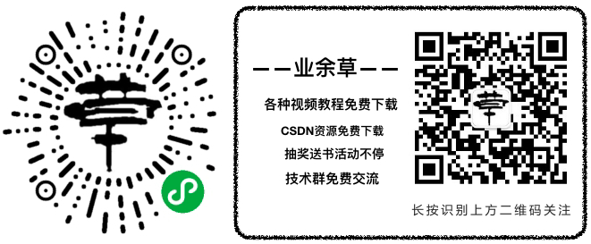

 [mongodb权限设计问题](https://segmentfault.com/q/1010000003940992)

## 可以充分利用MongoDB的特性，不需要特别去抽象某些共同点，甚至可以混存在一起，通过用户类型进行区分即可。NoSQL设计里不需要太在意列的概念（相同的属性），不然就失去了NoSQL的优势，甚至在之后会发现查询操作起来比SQL更麻烦。 

----


## 	MongoDB 创建角色  

 	MongoDB 里角色分为 ”内建角色“ 和 ”用户自定义“ 角色两种。内建角色是 MongoDB  为了方便用户管理和内部操作进行的预定义的一些权限。多数时候为了精细化权限控制 MongoDB 的内建角色无法满足我们的需求，因此需要 DBA  自定义角色来进行更加详细的权限控制。 

```csharp
`use xttblog //进入 xttblog 数据库` `db.createRole(``    ``{ ``    ``role:``"testrole"``,//角色名称``    ``privileges``: [ // 权限集``        ``{``            ``resource: //资源 ``                            ``{``                                    ``db:``"jhr"``, //创建的testrole角色具有对xttblog库的操作权限，具体权限建actions``                                    ``collection:``""` `//xttblog库下对应的集合名.如果为``""``表示所有集合``                            ``},``                        ``actions: [ ``"find"``, ``"insert"``, ``"remove"``,``"update"` `] //角色可进行的操作，注意这里是一个数组``                ``}``        ``],``        ``roles: [] // 是否继承其他的角色，如果指定了其他角色那么新创建的角色自动继承对应其他角色的所有权限，该参数必须显示指定``    ``}``)`
```

 	上述语句在 xttblog 库里创建了一个名为 testrole 的角色，该角色具有对数据库 xttblog 下的所有集合进行 find、insert、remove、update 的操作的权限。 

 	角色创建完毕后 MongoDB 会在系统库 admin 下创建一个系统 collection 名叫 system.roles 里面存储的即是角色相关的信息。 

 	可以使用下面的语句对创建的角色进行查看。 

```
`db.getCollection(``'system.roles'``).find({})` `db.system.roles.find();`
```

 	也可以使用下面的查询语句查看角色信息。 

```
`db.getRole(``"testrole"``, //要查看角色的名字``    ``{ ``        ``showPrivileges: ``true` `//指定查看角色信息的时候是否显示它所拥有的权限信息，也可不指定``    ``} ``)``// 业余草：www.xttblog.com``db.getRoles(``    ``{``      ``rolesInfo: 1,``      ``showPrivileges:``true``,``      ``showBuiltinRoles: ``true``    ``}``)`
```

 	角色权限的继承和角色权限回收。 

```
`//角色继承``db.grantRolesToRole(  ``    ``"testrole"``,``    ``[ ``"otherrole1"``,``"otherrole2"` `] // 将 otherrole1、otherrole2 两个角色（假设之前已经创建好）的权限授予testrole角色``)``// 业余草：www.xttblog.com``//角色权限回收``db.revokeRolesFromRole(``    ``"testrole"` `,``    ``[ ``"otherrole2"` `] // 撤销testrole角色从otherrole2角色所继承的所有权限``)`
```

##  	角色授权  

```
`db.grantPrivilegesToRole(``    ``"testrole"``,``    ``[``        ``{``            ``resource: //权限可操作的资源``            ``{``                ``db:``"xttblog"``,  // 授予testrole角色具有操作xttblog库的权限``                ``collection:``""` `// lidan_1库下的集合 如果为``""` `表示所有集合``            ``},                                                 ``            ``actions:  // 权限允许的操作``            ``[ ``"createCollection"``, ``"dropCollection"``,``"convertToCapped"``] //权限可进行的操作``        ``} ``    ``]``)`
```

 	执行完操作后 testrole 角色便可以对库 xttblog 下的所有集合进行 "createCollection", "dropCollection","convertToCapped" 操作。 

##  	角色权限回收  

```
`db.revokePrivilegesFromRole(``  ``"testrole"``,``  ``[``    ``{``        ``resource: //权限可操作的资源``        ``{``            ``db:``"xttblog"``,  // 回收角色对库 xttblog 的 actions 操作权限``            ``collection:``""` `//  xttblog 库下所有的集合 如果为``""` `表示所有集合``        ``},                                                 ``        ``actions:  // 权限允许的操作``        ``[ ``"createCollection"``, ``"dropCollection"``,``"convertToCapped"``] //需要回收的权限``     ``} ``  ``]``)`
```

 	执行完操作后 testrole 角色对库 xttblog 下的所有集合无法进行 "createCollection", "dropCollection","convertToCapped" 操作。 

##  	删除角色  

```
`db.dropRole(``"testrole"``) // 删除角色比较简单直接指定要删除角色的名称即可`
```

##  	创建用户  

```
`// 指定内建角色来创建用户``db.createUser(``    ``{``        ``user``:``'mongo'``, // 用户名``        ``pwd:``'123'``,    // 密码``        ``roles:[ ``            ``{``                ``role:``'root'``,// 通过指定内建角色root 来创建用户``                ``db:``'admin'`  `// 指定角色对应的认证数据库，内建角色通常认证库为admin``            ``}``        ``]``    ``}``);``// 指定自定义角色来创建用户，这里是在admin下创建的用户故认证库也是admin``db.createUser(``    ``{  ``        ``user``:``"mongo"``,// 用户名``        ``pwd:``"123"``,   // 密码``        ``roles:[``"testrole"``] //通过指定用户自定义角色来创建用户,注意这里是数组``    ``}``)`
```

##  	查看用户  

```
`db.getUser(``"mongo"``) // 查看用户比较简单只需要指定用户名即可`
```

 	为用户添加/回收角色 

```
`use admin``//为用户添加角色``db.grantRolesToUser(``    ``"mongo"``, // 用户名``    ``[ ``        ``{``            ``role: ``"testrole"``, // 需要添加的角色名 ``            ``db: ``"admin"` `// 角色对应的认证库，即角色创建时所在的数据库``        ``} ``    ``]``)``//对用户的角色进行回收，如果将用户所有的角色都回收完毕，那么用户只有对所属库的连接权限``db.revokeRolesFromUser(``    ``"mongo"``, // 用户名``    ``[ ``        ``{   ``            ``role: ``"testrole"``, // 需要回收的角色名 ``            ``db: ``"admin"` `// 角色对应的认证库，即角色创建时所在的数据库``        ``} ``    ``]``)`
```

##  	删除用户  

```
`db.dropUser(``"mongo"``); // 删除用户比较简单直接指定用户名即可`
```

 	好了，MongoDB 的角色权限就这么简单。最后强调一点，在 MongoDB 中删除库和集合并不会级联删除对应的角色和用户。因此如果想彻底删除对应的业务库因该先删除库及其对应的角色和用户。



最后，欢迎关注我的个人微信公众号：业余草（yyucao）！可加QQ1群：135430763(2000人群已满)，QQ2群：454796847(已满)，QQ3群：187424846(已满)。QQ群进群密码：xttblog，想加微信群的朋友，可以微信搜索：xmtxtt，备注：“xttblog”，添加助理微信拉你进群。备注错误不会同意好友申请。再次感谢您的关注！后续有精彩内容会第一时间发给您！原创文章投稿请发送至532009913@qq.com邮箱。商务合作可添加助理微信进行沟通！

本文原文出处：[业余草](https://www.xttblog.com)： » [详解 MongoDB 中的用户角色权限的分配与控制](https://www.xttblog.com/?p=3429)