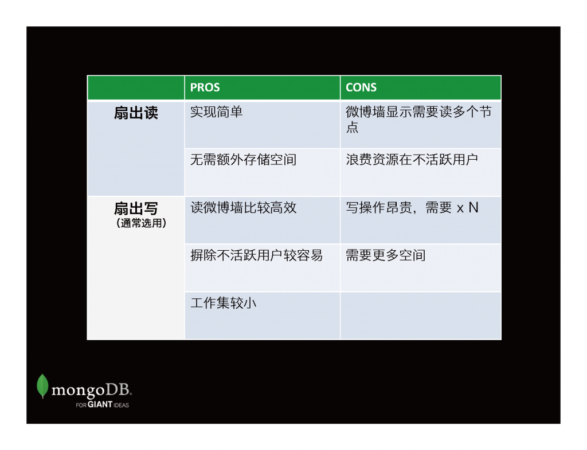

## TTL索引自动清理过期数据

指定时间间隔自动清理

items	冗余字段减少查表

##   Insert

update:注意$push的用法。$push 类似于javascript的操作符，意思是往数组尾部增加一个元素。

## update

更新item 4567的数量为5。 注意 items.$.quanity的使用，这里的$ 表示在查询条件里匹配上的数组元素的序数。

## count

商品的总数，可以使用MongoDB的聚合功能。聚合运算在MongoDB里面是对数据输入源进行一系列的运算。在这里我们做的就是几个步骤是：

1. $match: 在所有购物车中过滤掉其他商品，只选出id是8910的商品
2. $unwind: 把items 数组展开，每个数组元素变成一个文档
3. $group: 用聚合运算 $sum 把每一件商品的数量相加获得总和

### 关系集合

一个专门的集合来描述关注关系。这里就是一个内嵌和引用的经典选择。我们希望用内嵌，但是如果数组维度太大，就需要考虑用另外一个集合的方式来表示一对多的关系（用户 1–N 关注者）

## 单例模式

**关注数**，我们在显示关注和粉丝数量的时候，不希望去跑一次count 查询再显示。因为count操作一般来说会比较占资源。通常的做法可以再用户对象里面加两个字段，一个是关注数一个是粉丝数。每次有人关注或者关注别人时候就更新一下。

### 扇出写

实现微博墙的时候，有两种方式可以考虑：**扇出读** 或者是**扇出写**。

### 物联网的应用场景：

## 协作业数据源，参数属性，纬度统计分析场景多

飞机上面的数据源众多，光收集位置信息，就需要多个系统协作完成， 如ADS-C， EUROCONTROL等等。此外，收集的数据也是各种各样：位置是2D、速度是数值、引擎参数则是多维度的。

## 数据量庞大

设计一个超宽的表。所有需要采集的每一个值就是一个列。这种设计的问题比较明显：

1. 容易造成空白浪费，不是每一条记录都包含所有字段值
2. 可能会经常需要改数据库模式。对于海量数据，改一次模式代价巨大。

另一种改良方案是用EAV 设计模式。就是采用一个主表和一个属性值表。在属性值表里存放所有的参数键值对。这样做的好处自然是灵活性：增加新的参数时无需修改模式。但是问题同样存在：用来存储值的那列`METRIC_VALUE`的字节大小必须定义成所有值的最大值 才可以放下所有的参数值。这个可能带来空间浪费，但是更严重的问题是：将不太可能在此字段上建索引，进而影响一些场景的使用。

### 分桶的设计（时间段分组聚合）

